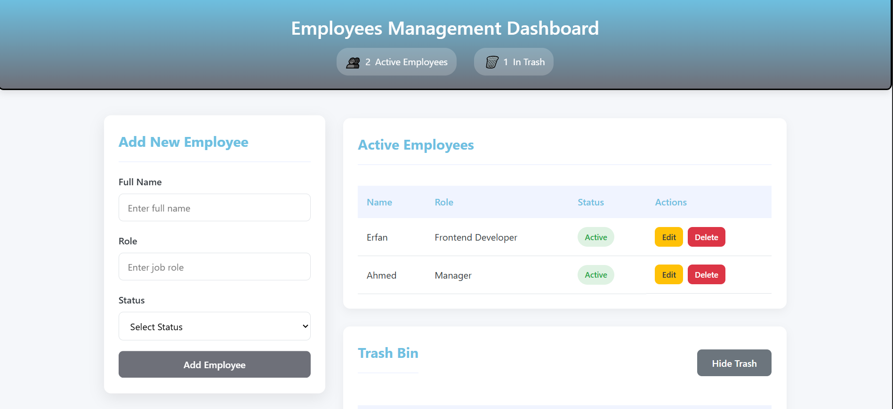

# Employees Management Dashboard  


A responsive web dashboard for managing employees with full CRUD (Create, Read, Update, Delete) functionality and trash/recovery system.


## Project Structure

├── index.html       # Main application page  
├── style.css        # All styling  
├── main.js          # Core functionality  
└── README.md        # Project documentation  

## Key Features  

- ✅ Add new employees with form validation  
- ✏️ Edit existing employee details  
- 🗑️ Trash system for deleted employees  
- 🔄 Restore employees from trash  
- 📊 Real-time counters for active/deleted employees  
- � Modern UI with interactive elements  
- 📱 Responsive design (works on mobile & desktop)  

## Technologies Used  

- HTML5  
- CSS3 (with CSS Variables)  
- Vanilla JavaScript  

## Getting Started  

1. Clone the repository:  
```bash
git clone https://github.com/yourusername/employees-management-dashboard.git